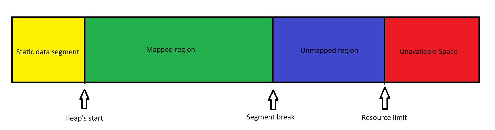
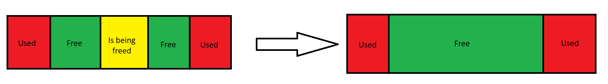

# Architecture Overview
### Data Segments
* Each process has its own virtual address space translated into physical memory address space. This space is devided into 5 distinct segments
    * **Stack** (dynamic - variable size)
    * **Heap** (dynamic - variable size)
    * **Uninitialized** (static - fixed size)
    * **Initialized** (static - fixed size)
    * **Text** (read only instrution segment - fixed size)
<br><br>

* While the **Stack** is used to store local variables, function calls' return addresses and input arguments, the focus of this project is the dynamic extension and shrinkage of the **Heap**.
* The **Heap** segment is an unorganized space used to store the program's data
    <br><br>
* In C the **Heap** is dynamically extended/shrinked through calling methods such as malloc() and free()
    <br><br>
* Under the hood, these methods use system calls such as **sbrk()** and **brk()** that move the segment break

### The Heap
* The **Heap** (Figure 1.0) is devided into multiple regions:
    * The start of the heap
    * Mapped region
    * Unmapped region
    * Unavailable space (prohibiteed by the OS)
### Figure 1.0

### sbrk()
* Method signature: ``` void *sbrk(intptr_t increment); ```
<br><br>
* Description: ```sbrk()``` increments the program's data space by increment bytes. Calling ```sbrk()``` with an increment of 0 can be used to find the current location of the program break
<br><br>
* Return value: On success, ```sbrk()``` returns the previous program break. (If the break was increased, then this value is a pointer to the start of the newly allocated memory). On error, (void *) -1 is returned, and errno is set to ENOMEM

### brk()
* Method signature: ``` int brk(void *addr); ```
<br><br>
* Description: ```brk()``` sets the end of the data segment to the value specified by addr, when that value is reasonable, the system has enough memory, and the process does not exceed its maximum data size
<br><br>
* Return value: On success, ```brk()``` returns zero. On error, -1 is returned, and errno is set to ENOMEM.

### No Man's Land
* Virtual memory is mapped by pages of fixed size which are system dependent. 
* Since the byte is way smaller than a page, the segment break might not be exactly at the boundary of a page. The space between the segment break and the boundary of the page is called No Man's Land. 
* No Man's Land is located outside of the heap, however in some cases, this space can be accessed for small amounts of data.

### The meta block design
* Memory is separated into 8-byte aligned blocks consisting of a metadata block and a payload. These blocks are managed through a doubly-linked list of metadata blocks stored as structs which define:
    * The size of the block
    * The address of the next metadata block
    * The address of the previous metadata block
    * The state of the memory block it is associated with (free/used)
    * Padding for 8-byte alignment
    * A flexible array member pointing to the address of the first byte of the data payload

```c
typedef struct block *meta_block;

struct block {
    size_t size;
    meta_block next;
    meta_block prev;
    int free;
    int padding;
    char anchor[1];
};
```
* System overhead and block size:
    * size_t size = 8 bytes
    * meta_block next = 8 bytes
    * meta_block prev = 8 bytes
    * int free = 4 bytes
    * int padding = 4 bytes
    * char anchor[1] = 1 byte + 7 bytes of padding
    * **TOTAL: 40 bytes** 

### Figure 1.1


<br><br><br>

# Key Features
### Alignment
* This system uses 8-byte alignment to ensure compatibility with 64-bit architectures, as well as 32-bit architectures(where 4-byte alignment is required)
* The sizes of both the metadata block and the data payload are divisable by 8
* Segmentation fault caused by misalignemnt is prevented
```c
[size][next][prev][free][padding]  |      [user_data/anchor]
<------- Metadata (40 bytes) ----> | <- User Space (8 * N bytes) ->
```
### Splitting Blocks
* If the payload size of a free block is large enough to accomodate the size in bytes demanded by the user, as well as the size of a meta block pointing to a payload of at leeast 8 bytes, the block is split (Figure 1.2)
* This logic prevents internal fragmentation by dividing large blocks into smaller ones
* The long-term effect of splitting blocks is that it reduces the need of extending the heap and it maximizes memory usage  

### Figure 1.2


### Fusion Coalescing
* When the user frees a block of memory, all free adjacent blocks are merged into a single free block
* This logic allows the user to uilize the mapped space more efficiently throuh coalecing small blocks, thus peventing external fragmentation (Figure 1.3)
* Unlike in the example, the actual method merges blocks recursively until there are no more free adjacent blocks

### Figure 1.3


### Realloc optimization
* Reallocating memory is done efficiently, through attempting coallecing adjacent blocks if the space does not suffice
* In case the space does suffice, nothing changes
* In case the space does not suffice, and coallecing does not improve the situation, the algorithm allocates memory through the **my_malloc** method
* If the change in size shrinks the payload, the algorithm attempts to split the current block (Figure 1.2) in order to prevent internal fragmentation

# Testing And Reliability

### Framework: **CUnit** 

### Suites And Tests

| Suite Name | Number of Tests |
| :--- | :--- |
| align suite | ```4 tests``` |
| find_block suite | ```3 tests``` |
| extend_heap | ```2 tests``` |
| split_block | ```2 tests``` |
| fusion | ```3 tests``` |
| get_pointer_to_meta_block | ```1 tests``` |
| valid_addr | ```3 tests``` |
| my_free | ```2 tests``` |
| my_malloc | ```6 tests``` |
| my_calloc | ```7 tests``` |
| copy_block | ```2 tests``` |
| my_realloc | ```8 tests``` |
| find_last_block | ```1 tests``` |

### Performance:
* 13 suites
* 44 tests
* 137 asserts (due to asserts in loops testing integrity so data isn't lost)
* Elapsed time: 2 - 3.5 seconds
* **Observation:** Elapsed time is pretty bad because of the **Volume** tests for ```my_malloc``` and ```my_calloc``` 
```c
void test_my_malloc_volume(void) {
    int *ptr;
    for(int i = 0; i < 1e4; i++) { 
        ptr = (int *)my_malloc(i);
    }
}

void test_my_calloc_volume(void) {
    int *ptr;
    for(int i = 0; i < 1e4; i++) { 
        ptr = (int *)my_calloc(i, 4);
    }
}
```
* In the tests above, the time complexity is ```O(n)``` for ```n``` equals the amount of blocks that divide the heap. For each iteration of the loop, the heap grows by one block, so the latency increases by a constant.
* When ```i``` has the upper bound set to ```1e5``` both tests take an average of 650 seconds. 
    * This will be fixed in later updates!

# How To Build And Run
### ```lcunit``` must be installed beforehand
### From the root of the project run the following commands:
### 1. Move to the tests directory
```c
cd tests
```
### 2. Compile the project
```c
gcc -o test_alloc test_alloc.c ../src/alloc.c -I../src -lcunit
```
### 3. Run the unit tests
```c
./test_alloc
```
<br><br>
# Internal Methods
### Observation: In the ```src/alloc.c``` file, each method has a short description of its purpose, input parameters and return value

### Block Alignment
```size_t align_64b(ssize_t x)```

* **Purpose:** Keep momory blocks aligned to 8 bytes for compatibility with 64-bit and 32-bit systems.

* **Logic:** Regardless whether the input value is a multiple of 8 or not, by subtracting 1 and multiplying the result by 8, then dividing the new result by 8, we get the biggest multiple of 8 smaller than the input value. At the end we add 8, thus we obtain the smallest multiple of 8 larger than the input value. 
* **Error Handling:** I chose ssize_t over size_t because if the user accidentally allocates a negative value, the number will not overflow into a positive value. Instead it will raise an error.      
    * Note: The positive value obtained through an overflow can be large and use a lot of memory. 
    
### Find Blocks
```meta_block find_block(meta_block *last, size_t size)```

* **Purpose:** Finds the first block that can accomodate the required size for the memory allocation and remembers the address of previous block.

* **Logic:** The method utilizes a first-fit algorithm which iterates through the doubly-linked list. 

### Extend The Heap
```meta_block extend_heap(meta_block last, size_t new_size)```

* **Purpose:** If no blocks can accomodate the size inputted by the user, the heap is extended.

* **Logic:** This method uses ```sbrk()``` to extend the mapped heap space and then creates a new block which is connected to the list.

* **Error Handling:** If ```sbrk()``` returns ```(void*)-1```, it means that the segment break has reached the **Resource limit** for the process so it returns ```NULL``` instead of the address of a block.

### Split Blocks
```void split_block(meta_block b, size_t new_size)``` 

* **Purpose:** Divides a large free block into an "allocated" part and a "remainder" free block.

* **Threshold:** I implemented a minimum threshold of ```BLOCK_SIZE + 8```. If the remainder is smaller than this, the split is skipped to prevent "splinters" that are too small to ever be reused, thus saving metadata overhead.

### Allocate Memory
```void *my_malloc(size_t new_size)```

* **Purpose:** Allocate an **8-byte** aligned block of memory.

* **Logic:** The algorithm processes the size and returns ```NULL``` if it is **zero**.<br> 
If the size is valid, it either extends the heap (if no blocks were large enough) or it finds the first block with the size larger than the one provided by the user. In addition, if fit, the algorithm tries to split the block before returning the address of the payload. 

### Allocate zero-initialized memory for an array
```void *my_calloc(size_t num, size_t size)```

* **Purpose:** Allocates memory for an array and initializes all bytes in the allocated block to zero.

* **Logic:** The algorithm uses the ```my_malloc``` method to allocate memory. Then, it iterates through the allocated data and it initialises each group of 8 bytes to **zero**.

### Coalesce Blocks
```meta_block fusion(meta_block block, int ok)```

* **Purpose:** After freeing a block, fuse (merge) all adjacent free blocks into a single block to prevent **external fragmentation**. Also when reallocating memory, if merges all adjacent blocks to create a larger block.

* **Logic:** The algorithm attempts to merge the current block with the ```next``` one. Then it attempts to merge the new current block with the ```previous``` one. After that, it repeats those steps until there are no more free adjacent blocks to merge.

* **Potential Issue:** The algorithm uses recursion, which occupies a new stack frame for each method call. 
    * **Note:** An iterative version of this method could be implemented in the future.

### Get The Address Of Metadata Blocks
```meta_block get_pointer_to_meta_block(void *ptr)```

* **Purpose:** Receives a pointer to a valid allocated memory and returns a pointer to the begining of the **metadata block**.

* **Logic:** The algorithm does simple pointher arithmetic and utilizes the predefined ```BLOCK_SIZE```: 
```C
#define BLOCK_SIZE offsetof(struct block, anchor)
```

### Validate Payload Address
```int valid_addr(void *p)```

* **Purpose:** Checks if a pointer points to an address from the heap and that points to an allocated memory.

* **Logic:** A payload pointer could be valid if the address it points to is after the ```base``` (first block) and if it is a multiple of 8 (8-byte aligned). <br>
The final check is done by verifying that the payload pointer is equal to the ```anchor``` of the result of passing the same pointer to the  ```get_pointer_to_meta_block``` method.

### Free Blocks
```void my_free(void *p)``` 

* **Purpose:** Marks the block as free, merges adjacent blocks and shrinks the heap if the block is at the end of the segment.

* **Logic:** The algorithm first verifies the validity of the pointer. If this test passes, then it attempts to merge all adjacent blocks.<br> 
Ultimately, it checks if the resulting block is at the end of the heap. If so, the heap segment is shrinked by using ```brk()```.

### Copy Blocks
```void copy_block(meta_block original, meta_block copy)```

* **Purpose:** Copies the data from a block to another to preserve previously allocated and initialized bytes.

* **Logic:** The algorithm iterates through each byte the payload of both the original block and it stores the content in the copy.

### Find Last Block
```meta_block find_last_block(void)```

* **Purpose:** Finds the last allocated memory block. This method is necessary in order to extend the heap.

* **Logic:** The algorithm iterates through the linked list and remembers the last block until the ```next``` component of the current block is ```NULL```.

### Reallocate Memory
```void *my_realloc(void *p, size_t new_size)```

* **Purpose:** Reallocates the memory for the new given size and pointer to previously allocated memory.
The data from the previously allocated memory is coppied or truncated in the new allocated block. This method is used to either increase or decrease the size of the payload of a block.

* **Logic:** The algorithm first checks if the provided pointer is not ```NULL```. If it is ```NULL```, the method acts exactly like ```my_malloc```. <br>
If the pointer is not ```NULL```, the algorithm checks if the pointer is valid through ```valid_addr()```. If it's not valid, the method returns ```NULL```. Otherwise, if the requested size is smaller than the **block** size, then the algorithm attempts to split the block. In this case the method returns the same pointer. <br>
In the case that the size of the block is not large enough, the heap is temporarily extended to create a copy. In an attempt to create more space, the algorithm merges adjacent free blocks to maximize the size using ```fusion()```. After that, the algorithm performs the same size check and attempts to split the new merged block if it got too big. After the contents of the payload are coppied, ```my_free``` is called on the temporary block in order to shrink the heap to its initial state. <br>
If even after merging, the size obtained is not enough, the method ```my_malloc()``` is called, thus extending the heap.

<br>

# Future Improvements

* Segregated Free Lists: To move from **O(n)** to **O(1)** search time, I plan to implement multiple free lists grouped by block size. The method most affected by this change will be ```find_block()```.

* **Thread Safety:** Current implementation is not thread-safe. Future iterations will include a global pthread_mutex or per-thread arenas to prevent race conditions.

* **Buddy Allocation:** Implementing a binary buddy system to improve the speed of splitting and merging.

